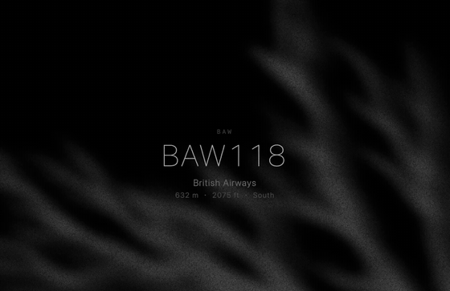

# Overhead Flights（頭頂航班）

[](./LICENSE)


A minimal **macOS screen saver** that quietly shows the nearest aircraft flying overhead.
極簡 **macOS 螢幕保護程式**：安靜顯示正飛過你頭頂的最近一班飛機。

[English](#english) · [繁體中文](#繁體中文)



🎬 Full demo video: [`portfolio/assets/overhead-flights-demo.mp4`](./portfolio/assets/overhead-flights-demo.mp4) (starts on an empty black screen, then fades in — that's by design)

---

## English

- Stays on screen continuously while a flight is in range (altitude refreshes every ~90s)
- Fully black when no flight is nearby
- **Start delay** stays whatever you set in System Settings (e.g. 20 min) — this project only replaces the screensaver **content**

> For AI agents: read [`SKILL.md`](./SKILL.md) and follow it — do not install an idle-watch agent.

### 🚀 Quick Start

**1. You need**

- A Mac + [Xcode](https://developer.apple.com/xcode/)
- Internet access

**2. Install the screensaver**

```bash
git clone https://github.com/rowanlin801229/overhead-flights.git
cd overhead-flights
cd macos
chmod +x build-and-install.sh
./build-and-install.sh
```

**3. Select it in System Settings**

1. **System Settings → Wallpaper → Change Screen Saver**
2. **Use screen saver → Custom**
3. Click **OverheadFlights** (same section as Fliqlo — scroll if needed)
4. Set **Start after…** to whatever delay you want (e.g. 20 min)
5. Done

If macOS blocks it from opening:

```bash
xattr -dr com.apple.quarantine ~/Library/Screen\ Savers/OverheadFlights.saver
```

Or in Finder: Control-click the `.saver` → Open.

**4. Ask an AI to do it for you**

With the repo open, tell Claude / Cursor / Grok:

```text
Read SKILL.md (overhead-flights) and install the Overhead Flights screensaver on this Mac.
Don't change my screensaver's start delay — just install the .saver and tell me how to select it under "Custom".
```

### ✨ Optional: fullscreen App / web preview

```bash
# App (open manually; move mouse/press a key to quit)
cd macos-app && ./build-app.sh

# Web preview
python3 -m http.server 8765
# http://localhost:8765
```

### 🌐 Data sources

| Purpose | Source |
|---------|--------|
| Aircraft position | [airplanes.live](https://airplanes.live) |
| Route / airline | [adsbdb](https://adsbdb.com) (credit: PlaneBase / David J Taylor, Edinburgh) |

Personal / portfolio use only; polls conservatively every 90s. Official rate limits aren't documented first-hand, so don't hardcode unverified numbers.

### 📖 Project structure

| Path | Description |
|------|--------------|
| `index.html` | All UI + data logic |
| `macos/` | Screen Saver build |
| `macos-app/` | Optional fullscreen App |
| `docs/overhead-flights-spec.md` | Product spec |
| `SKILL.md` | AI installation instructions |

### 📜 License

Code is [MIT licensed](./LICENSE). Live flight data comes from third-party APIs (airplanes.live, adsbdb) intended for personal / non-commercial use — please don't repurpose this into a commercial service.

### ⚠️ Limitations

- Unsigned build: friends may see a Gatekeeper prompt when installing
- macOS `.saver` only (no Windows build)
- On a new system, find it under **Custom**, not the landscape thumbnails row

### 🔗 Links

- Repo: [github.com/rowanlin801229/overhead-flights](https://github.com/rowanlin801229/overhead-flights)

---

## 繁體中文

- 在範圍內持續顯示（約 90 秒更新高度）
- 無飛機時全黑
- **啟動時間**請在系統設定裡自己設（例如 20 分鐘）— 本專案只替換螢保**內容**

> 給 AI：請讀 [`SKILL.md`](./SKILL.md)，照 skill 安裝，不要裝閒置監視 Agent。

### 🚀 最短路徑

**1. 你需要**

- Mac + [Xcode](https://developer.apple.com/xcode/)
- 網路

**2. 安裝螢保**

```bash
git clone https://github.com/rowanlin801229/overhead-flights.git
cd overhead-flights
cd macos
chmod +x build-and-install.sh
./build-and-install.sh
```

**3. 在系統設定選它**

1. **系統設定 → 背景圖片 → 更改螢幕保護程式**
2. **使用螢幕保護程式 → 自訂**
3. 點 **OverheadFlights**（和 Fliqlo 同一區，可能要往下找）
4. **啟動螢幕保護程式…** 設成你要的時間（例如 20 分鐘）
5. 完成

若提示無法打開：

```bash
xattr -dr com.apple.quarantine ~/Library/Screen\ Savers/OverheadFlights.saver
```

或：Finder 裡 Control-按鍵點 `.saver` → 打開。

**4. 跟 AI 怎麼說（像用 skill）**

把 repo 打開後對 Claude / Cursor / Grok 說：

```text
請讀 SKILL.md（overhead-flights），幫我在這台 Mac 安裝頭頂航班螢保。
不要改我的螢保等待時間，只安裝 .saver 並告訴我怎麼在「自訂」裡選中它。
```

### ✨ 選用：全螢幕 App / 網頁

```bash
# App（手動開、動滑鼠結束）
cd macos-app && ./build-app.sh

# 網頁預覽
python3 -m http.server 8765
# http://localhost:8765
```

### 🌐 資料來源

| 用途 | 來源 |
|------|------|
| 飛機位置 | [airplanes.live](https://airplanes.live) |
| 航線／航司 | [adsbdb](https://adsbdb.com)（底層致謝 PlaneBase / David J Taylor, Edinburgh） |

非商業／作品集用途；90 秒保守輪詢。官方速率上限未在一手文件核實，請勿寫死未證實數字。

### 📖 專案結構

| 路徑 | 說明 |
|------|------|
| `index.html` | 全部畫面與資料邏輯 |
| `macos/` | Screen Saver 建置 |
| `macos-app/` | 選用全螢幕 App |
| `docs/overhead-flights-spec.md` | 產品規格書 |
| `SKILL.md` | AI 執行說明 |

### 📜 License

程式碼採用 [MIT License](./LICENSE)。飛航資料由第三方 API（airplanes.live、adsbdb）提供，其條款以個人／非商業用途為前提，請勿改作商業服務。

### ⚠️ 限制

- 未簽名建置：分享時朋友可能看到 Gatekeeper 提示
- 僅 macOS `.saver`（非 Windows）
- 新系統請用 **自訂** 列表選取，不是風景縮圖那一排

### 🔗 Links

- Repo: [github.com/rowanlin801229/overhead-flights](https://github.com/rowanlin801229/overhead-flights)
