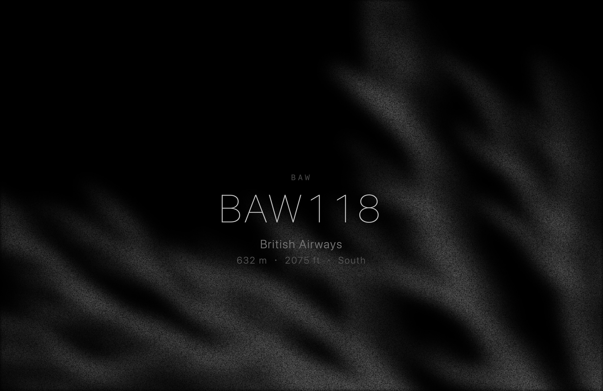

# Overhead Flights（頭頂航班）

[](./LICENSE)


極簡 **macOS 螢幕保護程式**：安靜顯示正飛過你頭頂的最近一班飛機。



🎬 Demo（無機全黑 → 淡入有機畫面）：[`portfolio/assets/overhead-flights-demo.mp4`](./portfolio/assets/overhead-flights-demo.mp4)

- 在範圍內持續顯示（約 90 秒更新高度）
- 無飛機時全黑
- **啟動時間**請在系統設定裡自己設（例如 20 分鐘）— 本專案只替換螢保**內容**

> 給 AI：請讀 [`SKILL.md`](./SKILL.md)，照 skill 安裝，不要裝閒置監視 Agent。

---

## 🚀 Quick Start

### 1. 你需要

- Mac + [Xcode](https://developer.apple.com/xcode/)
- 網路

### 2. 安裝螢保

```bash
git clone https://github.com/rowanlin801229/overhead-flights.git
cd overhead-flights
cd macos
chmod +x build-and-install.sh
./build-and-install.sh
```

### 3. 在系統設定選它

1. **系統設定 → 背景圖片 → 更改螢幕保護程式**
2. **使用螢幕保護程式 → 自訂**
3. 點 **OverheadFlights**（和 Fliqlo 同一區，可能要往下找）
4. **啟動螢幕保護程式…** 設成你要的時間（例如 20 分鐘）
5. 完成

若提示無法打開：

```bash
xattr -dr com.apple.quarantine ~/Library/Screen\ Savers/OverheadFlights.saver
```

或：Finder 裡 Control-按鍵點 `.saver` → 打開。

### 4. 跟 AI 怎麼說（像用 skill）

把 repo 打開後對 Claude / Cursor / Grok 說：

```text
請讀 SKILL.md（overhead-flights），幫我在這台 Mac 安裝頭頂航班螢保。
不要改我的螢保等待時間，只安裝 .saver 並告訴我怎麼在「自訂」裡選中它。
```

---

## ✨ 選用：全螢幕 App / 網頁

```bash
# App（手動開、動滑鼠結束）
cd macos-app && ./build-app.sh

# 網頁預覽
python3 -m http.server 8765
# http://localhost:8765
```

---

## 🌐 資料來源

| 用途 | 來源 |
|------|------|
| 飛機位置 | [airplanes.live](https://airplanes.live) |
| 航線／航司 | [adsbdb](https://adsbdb.com)（底層致謝 PlaneBase / David J Taylor, Edinburgh） |

非商業／作品集用途；90 秒保守輪詢。官方速率上限未在一手文件核實，請勿寫死未證實數字。

---

## 📖 專案結構

| 路徑 | 說明 |
|------|------|
| `index.html` | 全部畫面與資料邏輯 |
| `macos/` | Screen Saver 建置 |
| `macos-app/` | 選用全螢幕 App |
| `docs/overhead-flights-spec.md` | 產品規格書 |
| `SKILL.md` | AI 執行說明 |

---

## 📜 License

程式碼採用 [MIT License](./LICENSE)。飛航資料由第三方 API（airplanes.live、adsbdb）提供，其條款以個人／非商業用途為前提，請勿改作商業服務。

## ⚠️ 限制

- 未簽名建置：分享時朋友可能看到 Gatekeeper 提示
- 僅 macOS `.saver`（非 Windows）
- 新系統請用 **自訂** 列表選取，不是風景縮圖那一排

---

## 🔗 Links

- Repo: [github.com/rowanlin801229/overhead-flights](https://github.com/rowanlin801229/overhead-flights)
